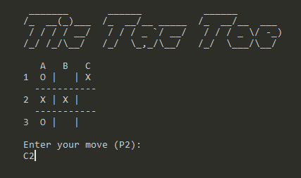

# Tic Tac Toe

Study project for learning C.



## Prerequisites

- Windows
- [CMake](https://cmake.org/)
- [CMake generator: Visual Studio 17 2022](https://cmake.org/cmake/help/latest/generator/Visual%20Studio%2017%202022.html)
- [Python 3](https://www.python.org/downloads/)

## Installation

```.sh
run init # initialize ./bin directory
run build # build the project
run start # start the application
```

## Other commands

```.sh
run test # run the test suite
run clean # remove the ./bin directory
```
